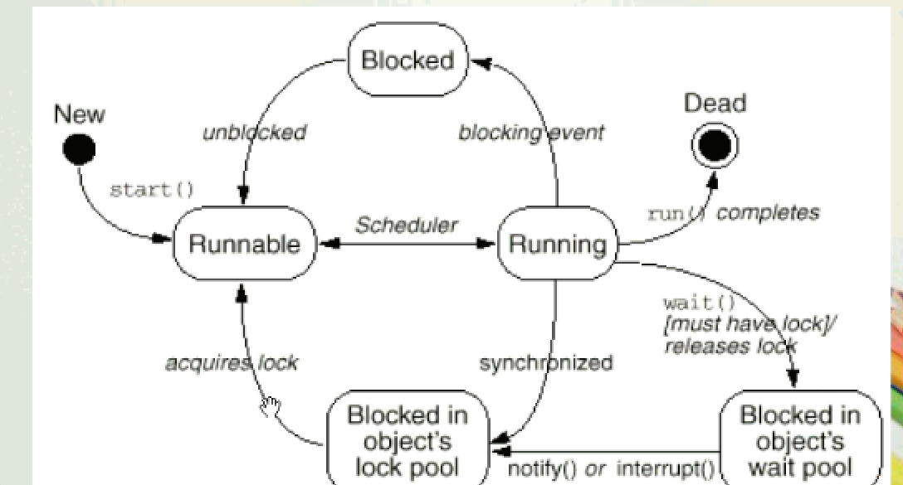
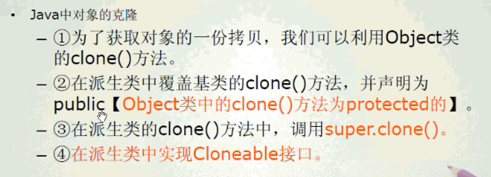

- 如果某个synchronized 方法是static的，那么线程访问该方法，锁的并不是synchronized方法所在的对象，而是synchronized
方法所在对象所对应的class对象，因为java中无论一个类有多少个对象，都会唯一对应的一个Class对象，因此当线程分别访问同一个
类的两个对象的两个static，synchronized方法时，他们的执行顺序也是顺序的，也就是说一个线程先去执行方法，执行完毕
后另一个线程开始执行。

- synchronized 块，写法：
  - 目的是为了细粒度完成多线程，某些访问会冲突，而其他的可以使用多线程执行，提高执行速度
  - synchronized 方法是一种粗粒度的并发控制，某一时刻，只能由一个线程执行该方法，而synchronized 块可以细粒度
```text
public void method{


synchronized(object){
 

}
}
```

- 死锁（deadlock）: 

## wait,notify,notifyAll

- 当程序进入wait后，已经和判断条件无关，等到被唤醒之后，直接执行后面的代码，如果判断条件是if，则容易出错，而while会
使得每次被唤醒之后，再次判断。

- wait 和 notify 方法都是定义在Object类中，是final类型，因此无法重写，这两个方法要求在调用时线程已经获得了对象的锁，
因此这两个方法的调用需要放在synchronized方法或块中。   *当执行了wait方法时，释放掉对象的锁*

- Thread.sleep，导致线程睡眠指定的毫秒数，但线程在睡眠的过程中不会释放掉对象的锁。



# 深拷贝与浅拷贝


- 通过序列化的方式实现深拷贝


