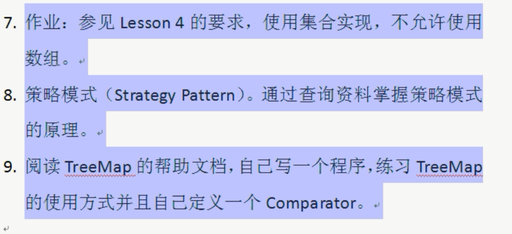

```python
class MyComparator implements Comparator {
    @Override
    public int compare(Object o1, Object o2) {
        Integer i1=(Integer) o1;
        Integer i2=(Integer) o2;

        if (i1>i2) return -1;   // 第一个值大于第二个值，返回1 为从小到大，反之为从大到小
        else  if (i1<i2) return 1;
        else return 0;
    }
}
```


# 策略模式
- 封装变化的概念
- 编程中使用接口，而不是对接口的实现

## 组成
- 抽象策略角色： 通常由接口或抽象类实现(Comparator)
- 具体策略角色： 包装相关的算法和行为(MyComparator)
- 环境角色： 持有一个策略类的引用，最终给客户端调用 （TreeSet,TreeMap）

## 实现

- 策略模式的用意是针对一组算法，将每一个算法封装具有共同接口的独立的类，从而使得它们
可以相互替换

- 使用策略模式可以把行为和环境分隔开

- 环境类负责维持和查询行为类，各种算法则在具体策略中提供，由于算法
和环境独立开来，算法的修改都不会影响环境和客户端。

## 步骤
- 1 定义接口
- 2 编写策略类，实现上面的接口
- 3 在使用策略对象类中保存一个对策略对象的引用
- 4 使用策略对象的类中，实现对策略对象的set和get方法或者使用构造方法完成赋值


